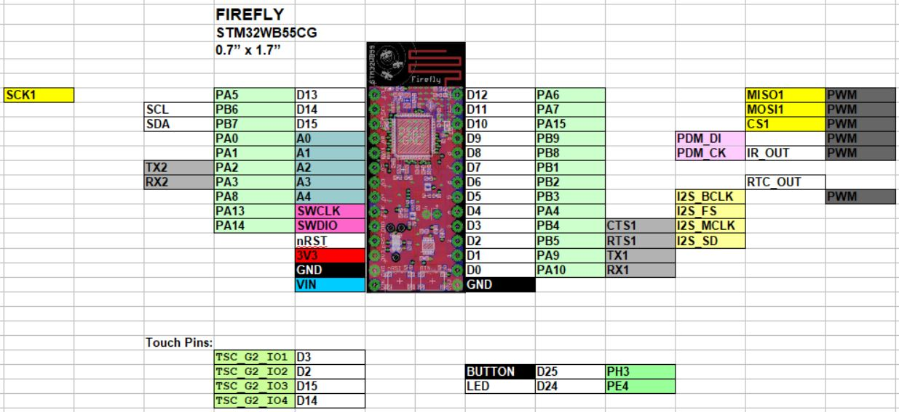
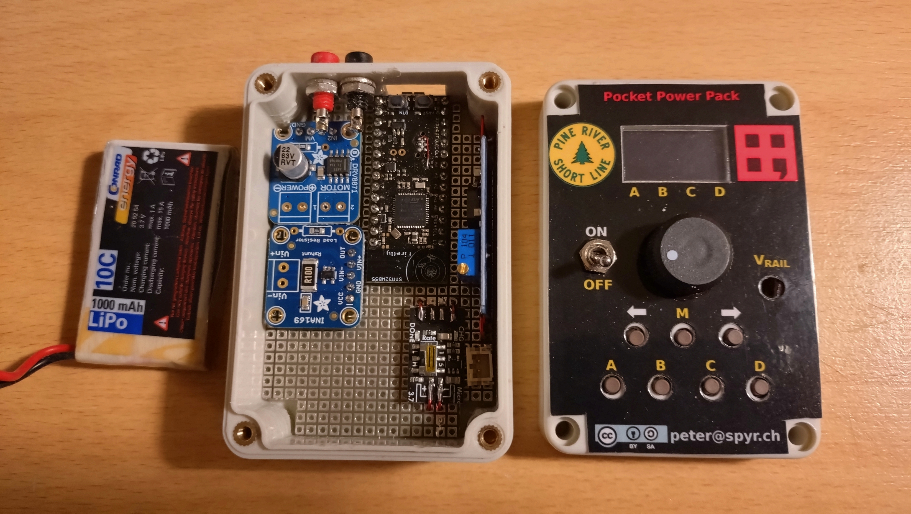
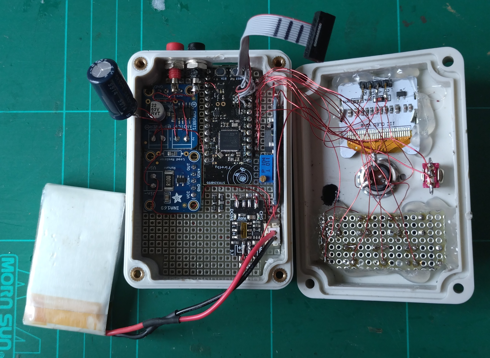

<table>
  <tr>
    <td>
 </td>
    <td></td>
  </tr>
</table> 

Board Support Package
=====================

The board support package for the STM32WB Firefly Development Board is restricted to the 
Arduino UNO R3 pin header and the onboard LED and switch (button). 
The STM32 has much more capabilities then 16 digital I/O pins, 5 analog input pins, 
UART, SPI, and I2C interfaces. But if you want to use the more advanced features you 
can use the CubeMX to create source code for the internal peripherals. 
This project wants to show how to use the Cube Ecosystem for a Forth system (or vice versa) 
and can't implement all features and possibilities the STM32WB has. 
It is a good starting point for your project.


Board Support Words
===================

Defaults: Digital port pins D0 to D8 are inputs, except D9 is output for neopixel, D1 for UART Tx. 
D10, D11, D12, and D13 are for the SD card. You are free to use the GPIO pins for other purposes.

```
led1!        ( f -- )         set LED1 (blue)
led1@        ( -- f )         get LED1 (blue)

switch1?     ( -- f )         get switch1, closed=TRUE
dport!       ( n -- )         set the digital output port (D0=bit0 .. D15=bit15).
dport@       ( -- n )         get the digital input/output port (D0=bit0 .. D15=bit15).

dpin!        ( f u -- )       set the digital output port pin u (D0=0 .. D15=15, A0=16 .. A4=20)  to f (TRUE 1, FALSE 0)
dpin@        ( u -- f )       get the digital input/output port pin u
dmod         ( u1 u2 -- )     set the pin u2 to mode u1: 0 in, 1 in pull-up, 2 in pull-down, 3 out push pull, 4 out open drain, 5 out push pull PWM
                                                6 input capture, 7 output compare, 8 I2C, 9 UART, 10 SPI, 11 analog

pwmpin!      ( u1 u2 -- )     set the digital output port pin u2 (D0=0, D1=1, A4=20) to a PWM value u1 (0..1000). Default frequency is 1 kHz, TIMER1
pwmprescale  ( u --  )        set the PWM prescale for TIMER1. 32 kHz / prescale, default 32 -> PWM frequency 1 kHz

EXTImod      ( u1 u2 -- )     set for pin u2 (D3, D5, D6, D7) the EXTI mode u1: 0 rising, 1 falling, 2 both edges, 3 none
EXTIwait     ( u1 u2 -- )     wait for EXTI interrupt on pin u2 (D3, D5, D6, D7), timeout u2 in [ms]

ICOCprescale ( u -- )         set the input capture / output compare prescale for TIMER2. default 32 -> 32 MHz / 32 = 1 MHz, timer resolution 1 us
ICOCperiod!  ( u -- )         set the input capture / output compare (TIMER2) period. default $FFFFFFFF (4'294'967'295). 
                              When the up counter reaches the period, the counter is set to 0. 
                              For prescale 32 the maximum time is about 1 h 11 m
ICOCcount!   ( u -- )         set the input capture / output compare counter for TIMER2
ICOCcount@   ( -- u )         get the input capture / output compare counter for TIMER2
ICOCstart    ( -- )           start the ICOC period
ICOCstop     ( -- )           stop the ICOC period
OCmod        ( u1 u2 -- )     set for pin u2 (D13=13, A2=18, A3=19 the Output Compare mode u1: 0 frozen, 1 active level on match, 2 inactive level on match, 
                              3 toggle on match, 4 forced active, 5 forced inactive
    
OCstart      ( u1 u2 -- )     start the output compare mode for pin u2 with pulse u1
OCstop       ( u -- )         stop output compare for pin u
ICstart      ( u -- )         start input capture u: 0 rising edge, 1 falling edge, 2 both edges
ICstop       ( -- )           stop input capture

waitperiod   ( -- )           wait for the end of the TIMER2 period
OCwait       ( u -- )         wait for the end of output capture on pin u
ICwait       ( u1 -- u2 )     wait for the end of input capture with timeout u1, returns counter u2

apin@        ( u1 -- u2 )     get the analog input port pin u1 (A0 .. A4). Returns a 12 bit value u2 (0..4095) 
vref@        ( -- u )         get the Vref voltage in mV (rather the VDDA, about 3300 mV)
vbat@        ( -- u )         get the Vbat voltage in mV (about 3300 mV)
CPUtemp@     ( -- u )         get CPU temperature in degree Celsius

I2Cput       ( c- u1 u2-- )   put a message with length u (count in bytes) from buffer at a to the I2C slave device u
I2Cget       ( c- u1 u2 -- )  get a message c- with length u1 from I2C slave u2 device to buffer at c-
I2Cputget    ( c- u1 u2 u3 -- ) put a message with length u1 from buffer at c- to the I2C slave device u3
                              and get a message with length u2 from device to buffer at c-

SPIget       ( c- u -- )      get a message with length u from SPI slave device to buffer at c-
SPIput       ( c- u -- )      put a message with length u from buffer at c- to the SPI slave device 
SPIputget    ( c- u1 u2 -- )  put a message with length u1 from buffer at c- to the SPI slave device 
                              and get a message with length u2 from device to buffer at c-
SPImutex     ( -- a- )        get the SPI mutex address
```


Using the Digital Port Pins (Input and Output)
==============================================

This example is a very simple chase lighting program inspired by Knight Rider. 
You need 8 LEDs and 8 resistors.

```forth
: init-port ( -- )
  11 16 dmod   \ set A0/D16 to analog
  8 0 do
    0 i dpin!
    3 i dmod \ port is output
  loop
;

: delay ( -- )
  50 osDelay drop  \ wait 50 ms
;

: left ( -- ) 
  7 0 do
    1 i dpin! 
    delay
    0 i dpin!
  loop 
;

: right ( -- )
  8 1 do  
    1 8 i - dpin! 
    delay
    0 8 i - dpin!
  loop 
;

: knigthrider ( -- )
  init-port
  begin 
    left right 
  switch1? until 
  0 0 pin dpin!
;
```


Using the ADC (Analog Input Pins)
=================================

`apin@ ( a -- u )` returns the ADC value (12 bit, 0 .. 4095) from one of
the analog pins A0 to A4 (0 .. 4). Here I use the A0 to control the
delay.

```forth
: delay ( -- )
  0 apin@ 10 / osDelay drop  \ delay depends on A0
;
```

To get an idea how fast the ADC, RTOS, and the Forth program are. The
`left` or `right` word takes about 125 us, the `knightrider` loop about
50 us (no osDelay). Pretty fast for my opinion (STM32WB55 @ 32 MHz sysclock).

Create a task for the knigthrider (details see [How to Use Tasks](CmsisRtos.md#how-to-use-tasks)) 
to run it in the background:
```
task knigthrider&
knigthrider& construct
' knigthrider knigthrider& start-task
```

Using the PWM (Analog Output Pins)
==================================

Only three port pins are supported so far. The TIMER1 is used for the
timebase, time resolution is 1 us (32 MHz SysClk divided by 32). The PWM
scale is from 0 (0 % duty cycle) to 1000 (100 % duty cycle), this
results in a PWM frequency of 1 kHz. If you need higher PWM frequencies,
decrease the divider and/or the scale.

PWM port pins: D0 (!TIM1CH3), D1 (!TIM1CH2), A4 (!TIM1CH1) 

Simple test program to set brightness of a LED on pin D3 with a
potentiometer on A0. Default PWM frequency is 1 kHz (prescaler set to
32). You can set the prescale with the word `pwmprescale` from 32 kHz
(value 1) down to 0.5 Hz (64000).

```forth
5 0 dmod   \ set D0 to PWM
11 16 dmod   \ set A0/D16 to analog

: pwm ( -- )
  begin 
    0 apin@  4 /  0 pwmpin!
    10 osDelay drop
    switch1? 
  until 
;
```

## Control an RC Servo

https://en.wikipedia.org/wiki/Servo_(radio_control): 
The control signal is a digital PWM signal with a 50 Hz frame rate. Within each 20 ms timeframe, 
an active-high digital pulse controls the position. The pulse nominally ranges from 1.0 ms to 
2.0 ms with 1.5 ms always being center of range. Pulse widths outside this range can be used for 
"overtravel" - moving the servo beyond its normal range. 

A servo pulse of 1.5 ms width will typically set the servo to its "neutral" position (typically 
half of the specified full range), a pulse of 1.0 ms will set it to 0°, and a pulse of 2.0 ms 
to 90° (for a 90° servo). The physical limits and timings of the servo hardware varies between 
brands and models, but a general servo's full angular motion will travel somewhere in the range 
of 90° – 180° and the neutral position (45° or 90°) is almost always at 1.5 ms. This is the 
"standard pulse servo mode" used by all hobby analog servos. 

The BSPs default PWM frequency is 1 kHz, 50 Hz is 20 times slower. The divider is therefore 32 * 20 = 640. 

| angle | time   | n   | 
|-------|--------|-----|
|   0°  | 1 ms   | 50  | 
|  45°  | 1.5 ms | 75  | 
|  90°  | 2 ms   | 100 | 
| 135°  | 2.5 ms | 125 | 
| 180°  | 3 ms   | 150 | 
| 225°  | 3.5 ms | 175 | 
| 270°  | 4 ms   | 200 | 


```forth
640 pwmprescale 
5 0 dmod   \ set D0 to PWM
11 16 dmod   \ set A0/D16 to analog

: servo ( -- ) 
  begin
    100 50 do# Using Input Capture and Output Compare


## Time Base

Default timer resolution is 1 us. The 32 bit TIMER2 is used as time base 
for Input Capture / Output Compare. For a 5 s period 5'000'000 cycles are needed. 
All channels (input capture / output compare) use the same time base.

```forth
: period ( -- )
  5000000 ICOCperiod! \ 5 s period
  ICOCstart
  begin
     waitperiod
     cr .time
  key? until
  key drop 
;
```

# Using Input Capture and Output Compare

## Time Base

Default timer resolution is 1 us. The 32 bit TIMER2 is used as time base 
for Input Capture / Output Compare. For a 5 s period 5'000'000 cycles are needed. 
All channels (input capture / output compare) use the same time base.

```forth
: period ( -- )
  5000000 ICOCperiod! \ 5 s period
  ICOCstart
  begin
     waitperiod
     cr .time
  key? until
  key drop 
;
```

## Output Compare

Output compare TIM2: D13=13 (!TIM2CH1), A2=18 (!TIM2CH3), A3=19 (!TIM1CH4) 
```forth
7 13 dmod \ output compare for D13
7 18 dmod \ output compare for A2/D18
7 19 dmod \ output compare for A3/D19

: oc-toggle ( -- )
  5000000 ICOCperiod! \ 5 s period
  ICOCstart
  3 13 OCmod  1000000 13 OCstart \ toggle D13 after 1 s
  3 18 OCmod  2000000 18 OCstart \ toggle A2 after 2 s
  3 19 OCmod  3000000 19 OCstart \ toggle A3 after 3 s 
  begin
     waitperiod
     cr .time
  key? until
  key drop 
;
```

When you abort (hit any key) the program, the timer still runs and controls 
the port pins. To stop the port pins:
<pre>
0 OCstop  1 OCstop  5 OCstop  
</pre>

Or change the prescale to make it faster or slower:
<pre>
1 ICOCprescale
</pre>


## Input Capture

This sample program measures the time between the edges on port A1. 
If no event occurs within 2 seconds, "timeout" is issued. 

Input capture port pin: A1 (!TIM2CH2)

Hit any key to abort program.
```forth
: ic-test ( -- )
  6 17 dmod \ input capture on A1
  ICOCstart
  2 ICstart  \ both edges
  ICOCcount@ ( -- count )
  begin
    2000 \ 2 s timeout
    ICwait ( -- old-capture capture ) 
    cr
    dup 0= if
      ." timeout" drop
    else 
      dup rot ( -- capture capture old-capture )
      - . ." us"
    then
  key? until
  key drop
  drop
  ICstop
;
```
If  you use a push button for A1, there could be several events on pressing the push button once.
This is called bouncing. 
Bouncing time is about 250 us for my push button.


# Using EXTI line

GPIO pins D3, D5, D6 and D7 can be used as an EXTI line. 
EXTIs are external interrupt lines, D3 uses EXTI_4 (EXTI Line 4 interrupt), 
D5 EXTI_3, D6 EXTI_2, and D7 EXTI_1. 

EXTI port pins: D3 (PB4), D5 (PB3), D6 (PB2), D7 (PB1)

If  you use a push button for D3, there could be several events on pressing the push button once.
This is called bouncing. 
For details see [A Guide to Debouncing](https://my.eng.utah.edu/~cs5780/debouncing.pdf).

```forth
: exti-test ( -- )
  2 3 EXTImod \ both edges on D3
  begin
    2000 3 EXTIwait \ wait for edge on D3 with 2 s timeout
    cr
    0= if
      3 dpin@ if
        ." rising edge"
      else
        ." falling edge"
      then 
    else
      ." timeout"
    then
  key? until
  key drop
;
```

# Using Push Buttons

## Switches

Most development boards have at least a switch or a push button, 
the Firefly has 2 switches, one is the reset switch.

```
switch1? .
```
The result is _0_. But if you press and hold the OK Button, the result will be _-1_. 
There is no debouncing for the `switchx?` words.


# Feather Wings

## Nucleo Arduino - Feather Adaptor

Feather adaptor built with a 
[Arduino Proto Shield Uno rev3](https://store.arduino.cc/products/proto-shield-rev3-uno-size). 
There is also a Grove I2C interface for an
[Octopus 128x64 OLED-Display](https://www.distrelec.ch/de/octopus-128x64-oled-display-pi-supply-pis-1277/p/30163414),
a [microSD adaptor](FileSystem.md#home-brewed-microsd-adapter-for-stm32wb55-nucleodongle-spi) (SPI),
and a Neopixel.


| Nucleo right| Function | Arduino  |  Feather     | Micro-SD  | Grove      |
|-------------|----------|----------|--------------|-----------|------------|
| PB8         | I2C1     | D15 SCL  | JP3.11 SCL   |           | SCL  Pin1  |
| PB9         | I2C1     | D14 SDA  | JP3.12 SDA   |           | SDA  Pin2  |
| AVDD        |          | AREF     |              |           |            |
| GND         |          | GND      | JP1.13 GND   | Pin3, Pin6| GND  Pin4  |
| PA5         | SPI1     | D13      | JP1.6  SCK   | Pin5      |            |
| PA6         | SPI1     | D12      | JP1.4  MISO  | Pin7      |            |
| PA7         | SPI1     | D11      | JP1.5  MOSI  | Pin2      |            |
| PA4         | (SPI)    | D10      | JP3.7  D10   | Pin1      |            |
| PA9         |          | D9       | JP3.8  D9    |           |            |
| PC12        | Neopixel | D8       |              |           |            |
| PC13        |          | D7       |              |           |            |
| PA8         |          | D6       | JP3.9  D6    |           |            |
| PA15        |          | D5       | JP3.10 D5    |           |            |
| PC10        |          | D4       |              |           |            |
| PA10        |          | D3       |              |           |            |
| PC6         |          | D2       |              |           |            |
| PA2         | UART     | D1 Tx    | JP1.2  D1    |           |            |
| PA3         | UART     | D0 rx    | JP1.3  D0    |           |            |

| Nucleo left | Function | Arduino  |  Feather     | Micro-SD  | Grove      |
|-------------|----------|----------|--------------|-----------|------------|
| NC          |          | IOREF    |              |           |            |
| NRST        |          | RESET    | JP1.16 RST   |           |            |
| 3V3         |          | 3.3V     | JP1.14/15 3V3| Pin4      | VCC Pin3   |
| 5V          |          | 5V       | JP3.3  USB   |           |            |
| GND         |          | GND      |              |           |            |
| GND         |          | GND      |              |           |            |
| VIN         |          | Vin      |              |           |            |
| PC0         |          | A0       | JP1.12 A0    |           |            |
| PC1         |          | A1       | JP1.11 A1    |           |            |
| PA1         |          | A2       | JP1.10 A2    |           |            |
| PA0         |          | A3       | JP1.9  A3    |           |            |
| PC3         |          | A4       | JP1.8  A4    |           |            |
| PC2         |          | A5       | JP1.7  A5    |           |            |
|             |          |          | JP3.1  VBAT  |           |            |
|             |          |          | JP3.2  EN    |           |            |

## Neopixel

NeoPixel is Adafruit's brand of individually addressable red-green-blue (RGB) LED. 
They are based on the WS2812 LED and WS2811 driver, where the WS2811 is integrated 
into the LED, for reduced footprint. Adafruit manufactures several products with 
NeoPixels with form factors such as strips, rings, matrices, Arduino shields, traditional 
five-millimeter cylinder LED and individual NeoPixel with or without a PCB. 
The control protocol for NeoPixels is based on only one communication wire. 

### Single NeoPixel

For the Nucleo I use D9 for the Neopixel. It takes about 30 us to set one Neopixel, 
during this time the interrupts are disabled. 

<pre>
3 9 dmod           \ D9 output
$ff0000 neopixel!   \ red LED 100 % brightness
</pre>

### NeoPixel Wing with 32 Pixels

NeoPixelWing uses the D6 as datapin for the Neopixels. 

Switch on the first 4 NeoPixels
```forth
3 6 dmod                       \ D6 output
32 cells buffer: pixelbuffer    \ create buffer for the neopixels
$ff0000 pixelbuffer !            \ 1st Neopixel red
$00ff00 pixelbuffer 1 cells + !   \ 2nd Neopixel green
$0000ff pixelbuffer 2 cells + !    \ 3th Neopixel blue
$7f7f7f pixelbuffer 3 cells + !     \ 4th Neopixel white 50 %
pixelbuffer 4 neopixels
```

Switch on all 32 NeoPixels
```forth
create pixels 
$010000 , $020000 , $040000 , $080000 , $100000 , $200000 , $400000 , $800000 , \ 1st row red
$008000 , $004000 , $002000 , $001000 , $000800 , $000400 , $000200 , $000100 , \ 2nd row green
$000001 , $000002 , $000004 , $000008 , $000010 , $000020 , $000040 , $000080 , \ 3th row blue
$808080 , $404040 , $202020 , $101010 , $080808 , $040404 , $020202 , $010101 , \ 4th row white
pixels 32 neopixels
```
It takes about 30 us to set one Neopixel, for 32 Pixels it takes nearly 1 ms, 
during this time the interrupts are disabled. Consider this for RT programs 
and interrupt latency.


## CharlieWing Plex LED Display

### Plex Words

`plex-emit` works like the standard word `emit`. It blocks the calling thread,
as long as the character is not written to the Plex display (less than 300 us
for a 6x8 character and 400 kHz I2C).
Horizontal (x) position is in pixel (0 to 15). The plex display is default shutdown,
to switch on `1 plexshutdown`. 

Implentation [plex.c](/peripherals/plex.c).

```
plex-emit    ( c -- )           Emit a character (writes a character to the Plex display)
plex-emit?   ( -- f )           Plex ready to get a character (I2C not busy)

hook-emit    ( -- a- )          Hooks for redirecting terminal IO on the fly
hook-emit?   ( -- a- )    

plexpos!     ( u -- )           Set Plex cursor position/column u
plexpos@     (  -- u )          Get the current Plex cursor position
plexclr      (  --  )           clear the Plex display, set the cursor to 0
plexfont     ( u -- )           Select the font, u: 0 6x8, 1 8x8
plexpwm      ( u -- )           default PWM 1 .. 255 (brightness)
plexshutdown ( f -- )           1 activate Plex dispaly, 0 shutdown display

plexcolumn!  ( u1 u2 n -- )     write LEDs (7 pixels) u2 at the position/column u1 (0 to 15) with the brightness n
plexcolumn@  ( u1 -- u2 )       read LEDs at position/column u1   
plexpixel!   ( u1 u2 n -- )     write one pixel at column u1 and row u2 with brightness n
plexpixel@   ( u1 u2 -- f )     read one pixel at column u1 and row u2

plexframe!   ( u -- )           Set the active frame u (0 .. 7) for write and read
plexframe@   (  -- u )          Get the active frame u
plexdisplay! ( u -- )           Show the display frame u
plexdisplay@ (  -- u )          Which frame is showed
```

### Sample Programs

Adafruit 15x7 [CharliePlex](https://learn.adafruit.com/adafruit-15x7-7x15-charlieplex-led-matrix-charliewing-featherwing) LED Matrix Display.
Driver is the IS31FL3731 [datasheet](https://www.issi.com/WW/pdf/31FL3731.pdf).

#### Count Down

```forth
1 plexshutdown
0 0 100 plexpixel!
1 1 200 plexpixel!

: count-down ( -- )
  plexclr
 -1 -1 -1 alarm!  \ an alarm every second
  wait-alarm  
  10 0 do
    1 plexpos!
    i 1 + 25 * plexpwm  \ set brightness
    i 0 = if 
      [char] 1 plex-emit
      [char] 0 plex-emit
    else
      [char] 0 plex-emit
      10 i - [char] 0 + plex-emit
    then
    wait-alarm  
  loop
   0 $ff -1 plexcolumn!
  14 $ff -1 plexcolumn!
  1 plexpos!
  [char] 0 dup plex-emit plex-emit 
  cr ." Launch!" cr
;
```

#### Marquee

```forth
: LCD>plex ( u -- ) \ copy LCD from column u to plex
  15 0 do \ write 15 charlie columns
    dup i + dup 126 mod swap 126 /  ( u -- u x y)
    lcdpos! lcdcolumn@  \ read LCD column
    i swap 50 plexcolumn! \ write PLEX column
  loop
  drop
;

: Marquee ( c- u -- ) \ marquee a string on charlie plex
  lcdclr  0 lcdfont 
  2dup >lcd 2swap type >term  \ write string to LCD
  nip ( c- u -- u )
  3 - \ remove trailing spaces
  begin
    dup 6 *  0 do \ all string columns, a char is 6 pixels wide
      i LCD>plex
      40 osDelay drop
      switch1? if leave then
    loop 
  switch1? until
  drop ( u -- )
;

1 plexshutdown

200 buffer: message
message .str"    MECRISP-CUBE REAL-TIME FORTH ON THE GO!   "
message strlen Marquee
```

# Pinouts

Very similar to the Teensy 3.0 [pinout](https://www.pjrc.com/teensy/pinout.html). 



   * Firefly https://www.tindie.com/products/tleracorp/firefly-ble-development-board/
   * Katydid https://www.tindie.com/products/tleracorp/katydid-wearable-ble-sensor-board 

## JTAG/SWD

| *JTAG Pin*  | *JTAG STM 14pin* | *JP3 Firefly*  | *JP7 Firefly* | *Description*  |
|-------------|------------------|----------------|---------------|----------------|
|             | 1                |                |               | NC             |
|             | 2                |                |               | NC             |
| 1           | 3                | 3              |               | 3V3 VDD        |
| 2           | 4                | 5              |               | SWDIO          |
| 3           | 5                | 2              |               | GND            |
| 4           | 6                | 6              |               | SWCLK          |
| 5           | 7                | 2              |               | GND            |
| 6           | 8                |                |               | SWO            |
| 7           | 9                |                |               | NC             |
| 8           | 10               |                |               | NC             |
| 9           | 11               | 2              |               | GND_DETECT     |
| 10          | 12               | 4              |               | NRST           |
|             | 13               |                | 5 (PA10)      | D0 UART_TX     |
|             | 14               |                | 4 (PA9)       | D1 UART_RX     |


# Pocket Power Pack

## Schematic 
[kicad schematic](kicad/pocket_power_pack/pocket_power_pack.kicad_sch)
 

## PCB
Perfboard square grid of 0.1 inches, 3" x 2" (30 x 20 1/10"), 76.5 x 51.5 mm, cut out corners (3 x 3 1/10"),
 

## Parts
[Modulgehäuse Sintron #207328](https://sintron-shop.de/produkte/bauelemente-gehaeuse-zubehoer/gehaeuse/21/modulgehaeuse-abs-83x58x33-mm-ip65) ABS 83x58x33 mm IP65, mit transparentem Deckel #207885.
 

 

### Knob Potentiometer
https://www.vishay.com/docs/51036/p16pa16.pdf


